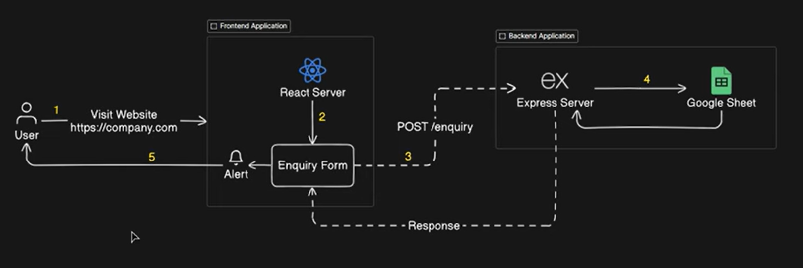

## Enquiry Capuring System
This system allows users to submit enquiries regarding services, feedback, or complaints. It collects information such as the user's name, email address, category of enquiry, and message, and stores it for further processing. The backend is powered by Express.js, and the frontend is built using React and Vite.

## Overview of ECS system

